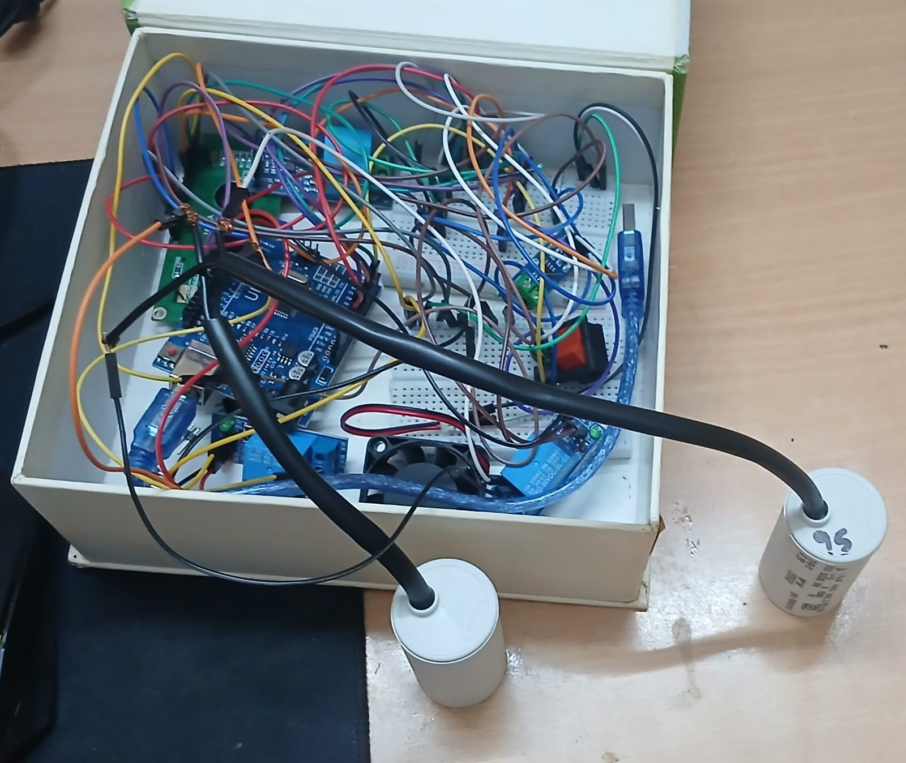
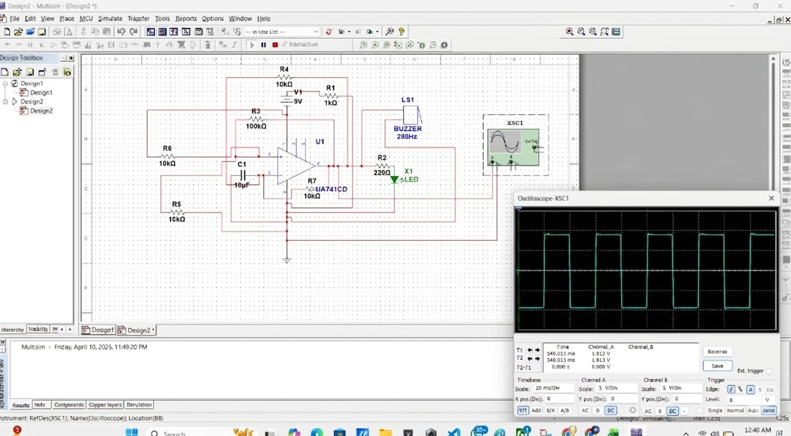

# Power Factor Estimation and Correction with Real-Time Energy Tracking

## Introduction

Power factor is an important parameter in electrical systems. A low power factor causes higher current consumption, increased transmission losses, and reduced system efficiency.

This project was developed to estimate the power factor of an electrical load and automatically improve it using capacitor bank switching. The system also monitors electrical parameters and demonstrates the improvement in power factor before and after correction.

---

## Hardware Prototype

<p align="center">
  
</p>

<p align="center">
  <i>Hardware implementation of the Power Factor Estimation and Correction System</i>
</p>

---

## Simulation Output

<p align="center">
  
</p>

<p align="center">
  <i>Simulation of the proposed Power Factor Correction System</i>
</p>

---

## Objective

The objectives of this project are:

- To measure voltage and current using sensors.
- To estimate power factor.
- To improve power factor automatically.
- To reduce reactive power.
- To improve overall efficiency of the electrical system.
- To monitor electrical parameters in real time.

---

## Components Used

### Hardware Components

- Arduino UNO
- ESP32
- ACS712 Current Sensor
- ZMPT101B Voltage Sensor
- IC741 Operational Amplifier
- Relay Module
- Capacitor Bank
- 16×2 LCD Display
- IC7805 Voltage Regulator
- IC7812 Voltage Regulator
- Transformer
- IN4007 Diodes

### Software Used

- Arduino IDE
- Multisim
- Embedded C

---

## Working Principle

The ACS712 sensor is used to measure the current flowing through the load while the ZMPT101B sensor is used to measure the supply voltage.

The sensor outputs are conditioned using IC741 operational amplifiers and provided to the Arduino UNO for processing.

The Arduino estimates the power factor and continuously monitors system performance.

Whenever the power factor drops below the specified threshold, relay modules switch capacitor banks across the load.

The capacitors compensate reactive power and improve the power factor.

The corrected values are displayed and monitored continuously.

---

## Arduino Program

The Arduino source code used for this project is available in:

```text
firmware/PowerFactorCorrection.ino
```

---

## Experimental Results

The hardware prototype was tested with a resistive-inductive load.

| Parameter | Before Correction | After Correction |
|------------|-------------------|------------------|
| Power Factor | 0.851 | 0.978 |
| Line Current | 1.39 A | 1.18 A |
| Reactive Power | 178.4 VAR | 58.2 VAR |
| Active Power | 318.6 W | 318.6 W |
| Apparent Power | 374.2 VA | 325.8 VA |

### Observation

- Power factor improved significantly.
- Reactive power reduced considerably.
- Line current reduced after correction.
- Overall efficiency improved.

---

## Folder Structure

```text
Power-Factor-Estimation-and-Correction/

│
├── README.md
│
├── firmware/
│   └── PowerFactorCorrection.ino
│
├── images/
│   ├── perfecthardware.JPEG
│   └── perfectsimulation.JPEG
│
├── docs/
│   └── Project_Report.pdf
```

---

## Project Report

The complete project report is available in:

```text
docs/Project_Report.pdf
```

---

## Applications

- Industrial power factor correction systems
- Energy monitoring systems
- Educational laboratory experiments
- Distribution and power quality studies
- Smart energy management applications

---

## Future Improvements

- Real-time phase angle measurement
- Mobile application integration
- Cloud-based monitoring
- Wi-Fi dashboard using ESP32
- Automatic electricity penalty calculation

---

## Author

- Sahana D (24UEC040)
Department of Electronics and Communication Engineering

---

## Conclusion

The project successfully demonstrates estimation and automatic correction of power factor using capacitor bank switching. Experimental results show a clear improvement in power factor and reduction in reactive power, making the system suitable for educational and industrial applications.
